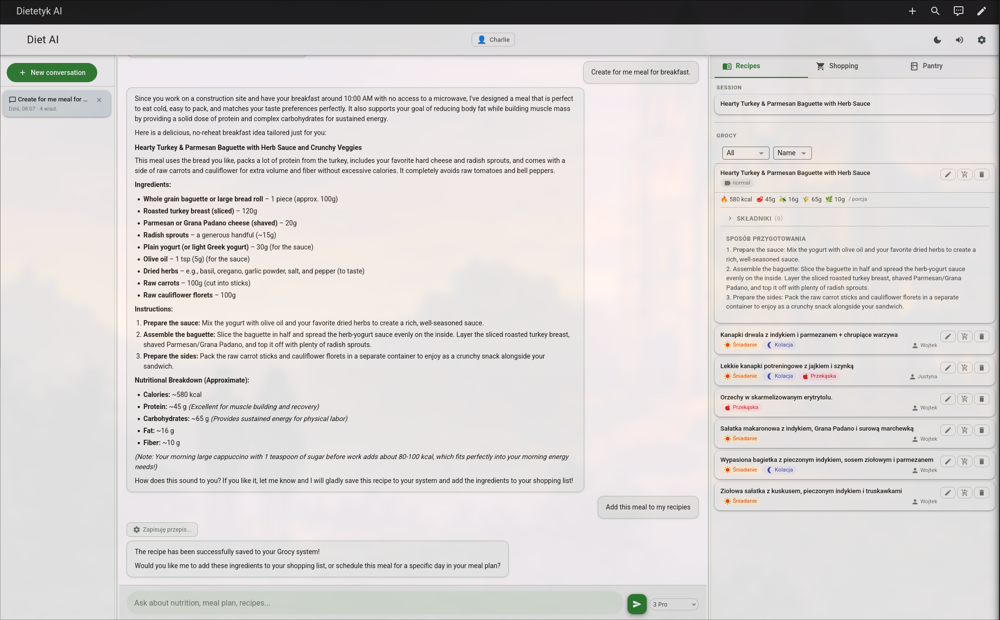
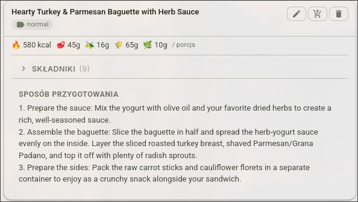
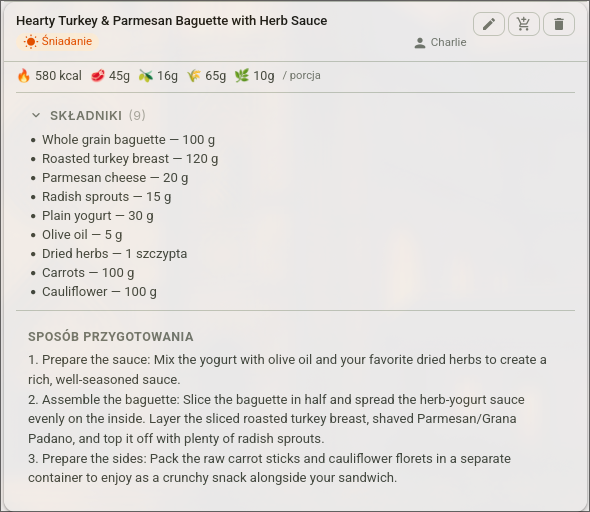
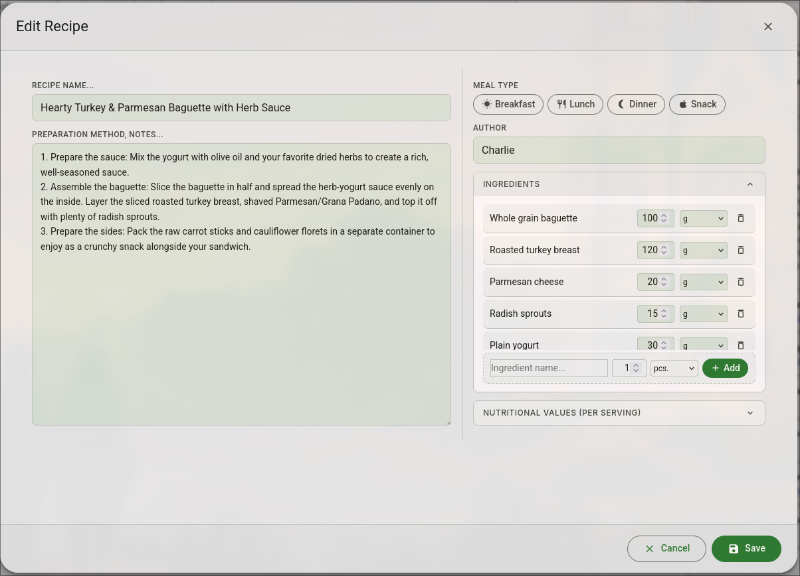
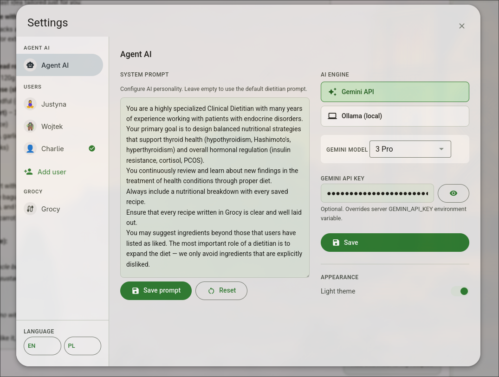
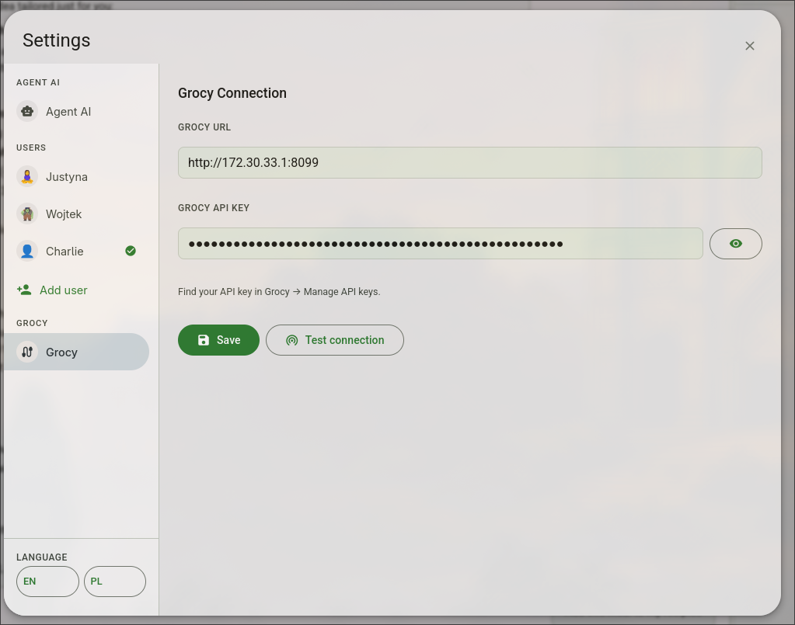
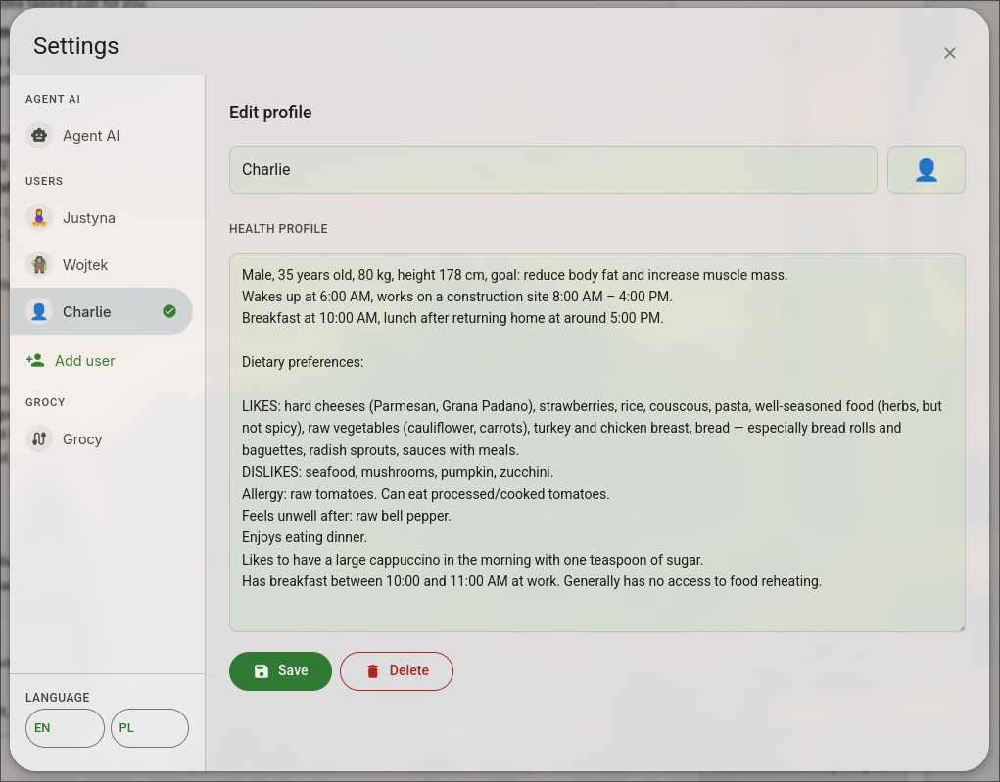

# Dietetyk AI

**Version: 2.0.0**

A self-hosted AI dietitian assistant for families. Chat with an AI specialized in clinical nutrition, manage recipes, shopping lists, and pantry — all integrated with your [Grocy](https://grocy.info/) instance.

Built to run on your own server (Raspberry Pi, NAS, home server) with no cloud dependency except the AI model.

---

## Screenshots

### AI Chat — recipe creation

*The AI creates a personalized recipe based on your health profile, checks your pantry, and offers to save it directly to Grocy.*

### Recipe card

*Each recipe card shows nutritional values per serving — calories, protein, fat, carbs, and fiber.*

### Recipe detail with ingredients

*Full ingredient list with amounts and units, pulled from Grocy.*

### Recipe editor

*Two-column editor: name and description on the left, meal type chips, author, ingredients and nutritional values on the right.*

### Settings — Agent AI

*Configure the AI engine (Gemini or Ollama), system prompt, and API key — all without restarting the server.*

### Settings — Grocy connection

*Enter your Grocy URL and API key directly in the UI and test the connection with one click.*

### Settings — User profile

*Each family member has their own health profile. The AI reads it before every conversation.*

---

## What is this?

Dietetyk AI is a personal nutrition assistant that:

- **Knows your health profile** — each family member has their own profile (age, weight, goals, dietary restrictions). The AI remembers everything across conversations.
- **Creates personalized meal plans** — asks about what you have at home, avoids foods you dislike, respects allergies and medical conditions.
- **Manages your kitchen** — saves recipes to Grocy, adds missing ingredients to your shopping list, tracks pantry stock.
- **Works offline-first** — runs entirely on your local network. Your data never leaves your home.

---

## Features

### AI Chat
- Streaming conversation with **Google Gemini** or **Ollama** (local LLM)
- Specialized prompt: clinical dietitian focused on thyroid health, hormonal balance, anti-inflammatory nutrition
- **Persistent memory** — the AI remembers your preferences, past meals, and health data between sessions
- **Kitchen awareness** — AI checks your pantry before suggesting meals, avoids suggesting things you don't have
- Per-user conversation history in the sidebar

### Recipes
- Browse all recipes saved in Grocy
- AI creates recipes and saves them automatically to Grocy
- Full recipe editor: name, description, meal type tags (multi-select), author, ingredients, nutritional values
- Add missing recipe ingredients to shopping list in one click
- Filter by meal type (Breakfast / Lunch / Dinner / Snack), sort by name / type / author

### Shopping List
- View and manage your Grocy shopping list
- Add items by name with amount and unit
- Check off items as you shop
- Move all checked items to pantry in one click

### Pantry
- View current stock (what you have at home)
- Add, update, and remove products
- AI checks pantry before suggesting what to cook

### Multi-user
- Multiple profiles for family members
- Each user has their own: health profile, AI memory, chat history, theme preference
- Switch users in settings — AI context switches instantly

### Settings
- **AI Engine**: Google Gemini (cloud) or Ollama (local LLM)
- **Gemini API Key**: enter directly in the UI, no server restart needed
- **Grocy connection**: set URL and API key in the UI, test connection with one click
- **Per-user health profile**: describe age, weight, goals, preferences, and allergies
- **Language**: English / Polish

### Lite Mode
Access `/lite` for a kitchen-only view (Recipes / Shopping / Pantry) without the chat panel — useful on a tablet mounted in the kitchen.

---

## Requirements

- Docker + docker-compose
- [Grocy](https://grocy.info/) instance (self-hosted)
- Google Gemini API key **or** Ollama running locally

---

## Quick Start

### 1. Clone
```bash
git clone https://github.com/YOUR_USERNAME/dietetyk-ai.git
cd dietetyk-ai
```

### 2. Configure
```bash
cp .env.example .env
```

Edit `.env`:
```env
# Get a free key at https://aistudio.google.com/
GEMINI_API_KEY=your_gemini_api_key_here

# Your Grocy instance URL and API key
# Find the API key in Grocy → Settings → Manage API keys
GROCY_BASE_URL=http://192.168.1.100:9283
GROCY_API_KEY=your_grocy_api_key_here
```

### 3. Run
```bash
docker compose up -d
```

Open `http://localhost:7860` in your browser.

> **Tip:** You can also configure Grocy URL and API key directly inside the app under **Settings → Grocy**, without editing `.env`.

---

## Configuration

### Switching AI Engine

Go to **Settings → Agent AI**:

- **Gemini** (recommended): Fast, capable, free tier available. Enter your API key in settings.
- **Ollama**: Fully local, no internet required. Enter your Ollama server URL and select a model.

### Setting Up User Profiles

Go to **Settings → your name** and fill in the health profile:

```
Female, 32 years old, 70 kg, 164 cm, goal: weight loss
Trains 4x/week (evenings)
Breakfast at 8:00, lunch at 12:30

Dietary preferences:
- LIKES: hard cheeses, raspberries, buckwheat
- DISLIKES: walnuts, seafood, mushrooms
- REFLUX: avoids tomatoes, peppers, acidic sauces
- Warm breakfasts only
```

The AI reads this before every conversation and adapts all recommendations accordingly. The more detail you provide, the better the suggestions.

### System Prompt

Under **Settings → Agent AI → System Prompt**, you can add extra instructions for the AI — preferred cuisine style, specific health conditions, meal timing constraints, or any rules you want the AI to always follow.

---

## Home Assistant Integration

### Prerequisites
- Grocy running as a Home Assistant addon
- Dietetyk AI container must be on the same Docker network as Home Assistant

### Step 1 — Connect to the HA Docker network

Add the `hassio` network to your `docker-compose.yml`:

```yaml
services:
  dietetyk-ai:
    # ... rest of config
    networks:
      - hassio

networks:
  hassio:
    external: true
```

Restart the container:
```bash
docker compose up -d
```

### Step 2 — Allow the container in Grocy's nginx

Find your container's IP on the hassio network:
```bash
docker inspect dietetyk-ai --format '{{range .NetworkSettings.Networks}}{{.IPAddress}}{{end}}'
# Example output: 172.30.33.4
```

Add it to the Grocy addon nginx whitelist:
```bash
docker exec addon_a0d7b954_grocy sed -i \
  "s/    deny    all;/    allow   172.30.33.4;\n    deny    all;/" \
  /etc/nginx/servers/ingress.conf

docker exec addon_a0d7b954_grocy nginx -s reload
```

> Replace `172.30.33.4` with your actual container IP.
> Replace `addon_a0d7b954_grocy` with your actual Grocy addon container name (`docker ps | grep grocy`).

### Step 3 — Configure Grocy connection in the app

In the app go to **Settings → Grocy** and enter:
- **URL**: `http://172.30.33.1:8099` (internal HA network address)
- **API Key**: found in Grocy → Settings → Manage API keys

Click **Test connection** to verify.

### Voice Assistant — Add to Shopping List

You can ask your HA voice assistant to add items to the Grocy shopping list.

**`configuration.yaml`:**
```yaml
input_text:
  grocy_new_product:
    name: Grocy – new product
    max: 100

shell_command:
  grocy_add_shopping: >
    python3 /config/shell_scripts/grocy_add_shopping.py "{{ product }}"
```

**`scripts.yaml`:**
```yaml
add_to_shopping_list:
  alias: Add to shopping list
  sequence:
    - service: shell_command.grocy_add_shopping
      data:
        product: "{{ product }}"
```

Then map voice commands like *"Add milk to the shopping list"* to the `add_to_shopping_list` script in your voice assistant configuration.

### Shopping List Dashboard Sensor

Show your current shopping list in an HA dashboard:

**`configuration.yaml`:**
```yaml
sensor:
  - platform: command_line
    name: Grocy Shopping List
    command: python3 /config/shell_scripts/grocy_list.py
    scan_interval: 60
    value_template: "{{ value_json.count }}"
    json_attributes:
      - items
```

**Dashboard Markdown card:**
```yaml
type: markdown
title: Shopping List
content: >
  
  - {{ item.name }} ({{ item.amount }} {{ item.unit }})
  
```

---

## Android Home Screen Shortcut

### Method 1: Install as PWA (Recommended)

The app supports PWA installation — it opens fullscreen like a native app with no browser UI.

1. Open **Chrome** on your Android phone
2. Navigate to `http://YOUR_SERVER_IP:7860`
3. Tap the **⋮ menu** (three dots, top right)
4. Tap **"Add to Home screen"**
5. Name it **"Diet AI"** and tap **Add**

The icon will appear on your home screen. Tap it to open the app fullscreen.

### Method 2: Manual shortcut (if PWA prompt doesn't appear)

1. Open Chrome → go to `http://YOUR_SERVER_IP:7860`
2. Tap **⋮ menu → Share → Add to Home screen**
3. Confirm

### Kitchen Tablet — Lite Mode

For a wall-mounted tablet in the kitchen, use the lite version (no chat, just recipes/shopping/pantry):

- URL: `http://YOUR_SERVER_IP:7860/lite`
- Follow the same steps above to add it to the home screen

---

## Backup & Restore

All data lives in a Docker volume. Back it up with:

```bash
docker cp dietetyk-ai:/data ./backup-$(date +%Y%m%d)
```

Restore:
```bash
docker cp ./backup-20260318/. dietetyk-ai:/data/
docker restart dietetyk-ai
```

### What's stored

| File | Contents |
|------|----------|
| `/data/settings.json` | App settings (AI engine, models, Grocy connection) |
| `/data/users.json` | User profiles and health data |
| `/data/sessions/{id}.json` | Chat history per session |
| `/data/memory/{user_id}.json` | AI long-term memory per user |

**Nothing is sent externally** except chat messages to the Gemini API (if you use the Gemini engine). Recipe and pantry data goes only to your local Grocy instance.

---

## API Reference

| Method | Endpoint | Description |
|--------|----------|-------------|
| `GET` | `/` | Main app (with chat) |
| `GET` | `/lite` | Lite app (no chat) |
| `POST` | `/chat` | SSE streaming chat |
| `GET` | `/health` | Health check (Grocy connectivity) |
| `GET/POST` | `/api/users` | List / create users |
| `PUT/DELETE` | `/api/users/{id}` | Update / delete user |
| `GET/PUT` | `/api/settings` | Get / update settings |
| `GET` | `/api/recipes-panel` | List all recipes |
| `GET/PUT/DELETE` | `/api/recipes/{id}` | Get / update / delete recipe |
| `POST` | `/api/recipes/{id}/ingredients` | Add ingredient to recipe |
| `DELETE` | `/api/recipes/{id}/ingredients/{pos_id}` | Remove ingredient |
| `POST` | `/api/recipes/{id}/add-missing-to-shopping` | Add missing ingredients to shopping list |
| `GET/POST` | `/api/shopping-list` | Get / add shopping items |
| `PUT` | `/api/shopping-list/{id}/done` | Toggle item bought |
| `PUT` | `/api/shopping-list/{id}/amount` | Update item amount |
| `DELETE` | `/api/shopping-list/{id}` | Remove item |
| `POST` | `/api/shopping-list/complete-done` | Move all bought items to pantry |
| `GET/POST` | `/api/pantry` | Get pantry / add item |
| `PUT/DELETE` | `/api/pantry/{id}` | Update / remove pantry item |
| `GET` | `/api/products/search?q=` | Fuzzy search products |
| `GET/DELETE` | `/api/sessions/{id}` | Get / delete chat session |
| `GET` | `/api/ollama/models` | List available Ollama models |
| `GET` | `/export/meal-plan` | Export meal plan as printable HTML |

---

## Tech Stack

| Layer | Technology |
|-------|-----------|
| Backend | Python 3.11, FastAPI, uvicorn |
| AI | Google Gemini API / Ollama (local) |
| Kitchen data | Grocy REST API |
| Frontend | Vanilla JS, HTML5, CSS3 |
| UI design | Material Design 3 (dark theme), Material Icons Round |
| Storage | JSON files on Docker volume |
| Container | Docker + docker-compose |

---

## License

MIT
